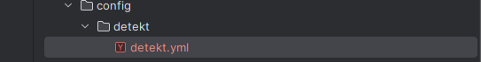
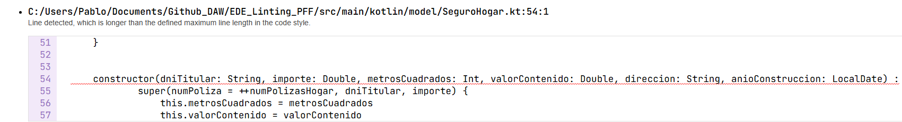
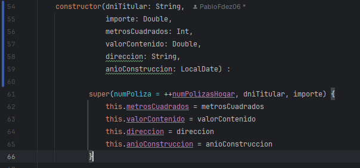
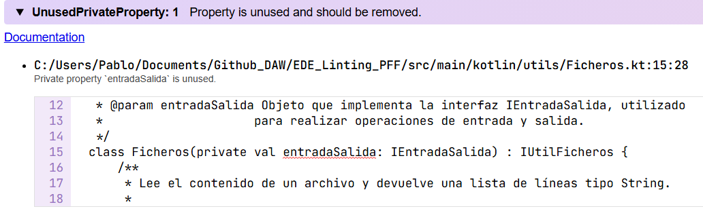
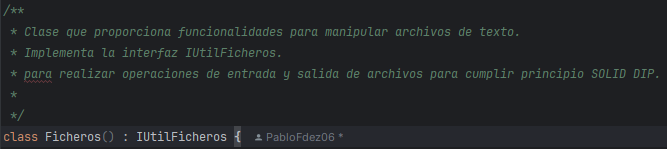
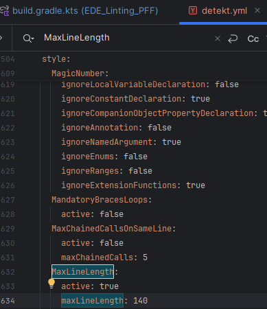
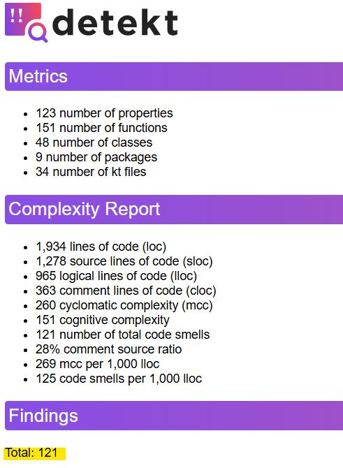
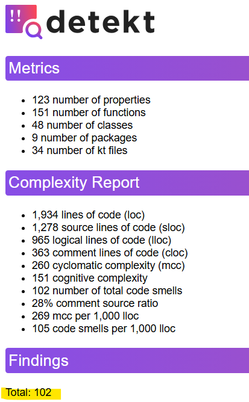

# EDE_Linting_PFF

# INSTALACIÓN DETEKT

1. Agrega Detekt al archivo build.gradle.kts
 ```
  plugins {
    id("io.gitlab.arturbosch.detekt") version "1.23.1"
  }

 ```
2. Sincronizamos el proyecto con Gradlew
3. Generamos el archivo de configuración: ```./gradlew detektGenerateConfig```. Lo que crea un archivo detekt.yml en la raíz o dentro de /config/detekt/.


# EJECUCIÓN DEL ANALISIS

- ``` ./gradlew detekt```

### RESULTADOS:

[Datos del Análisis](./build/reports/detekt/detekt.html)

## DETECCIÓN DE 5 ERRORES

Tras estar revisando el anáisis recibido por Detekt, he podido apreciar que mi código no tienen errores, al menos no de lógica, ni en cuanto a desarrollo del código. Si que se pueden apreciar que nos avisa de que algunas lineas exceden el máximo de largo recomendado, y que podiamos espaciarlas, adjunto referencia y solución:

**REFERENCIA**



**SOLUCIÓN APORTADA**



He detectado otro error, que se trata de que en la clase fichero estamos inyectando la UI a traves de la interfaz, pero realmente no la estamos utilizando, por lo cual nos exige que eliminemos el parametro, adjunto referencia y solución:

**REFERENCIA**



**SOLUCIÓN**




# RESPUESTA A LAS PREGUNTAS

**[1] Herramienta utilizada**

- 1.a Usé Detekt, sirve para analizar código y detectar errores de estilo y lógica en Kotlin.
- 1.b Características: Análisis estático, configuración flexible, integración con CI.
- 1.c Beneficios: Mejora la calidad del código, detecta errores temprano, fomenta buenas prácticas.

**[2] Impacto de los errores detectados**

- 2.a El error más útil fue el parámetro no utilizado.
- 2.b Sí, fue comprensible y mejoró la legibilidad.
- 2.c Se produjo por refactorizaciones que hicieron que finalmente ese parametro no fuese necesario.

**[3] Configuración personalizada**

- 3.a Posibilidades: Activar/desactivar reglas, cambiar umbrales, excluir carpetas.
- 3.b Configuré MaxLineLength a 140 caracteres.

- 3.c
  
  

**[4] Conclusiones**

El uso de Detekt ha mejorado la claridad y mantenimiento del código. Aunque no se encontraron errores lógicos graves, los avisos de estilo y limpieza ayudaron a mejorar la calidad general del proyecto. Es una herramienta muy recomendable para equipos que trabajen en Kotlin.

- **ANTES**



- **DESPUES**

